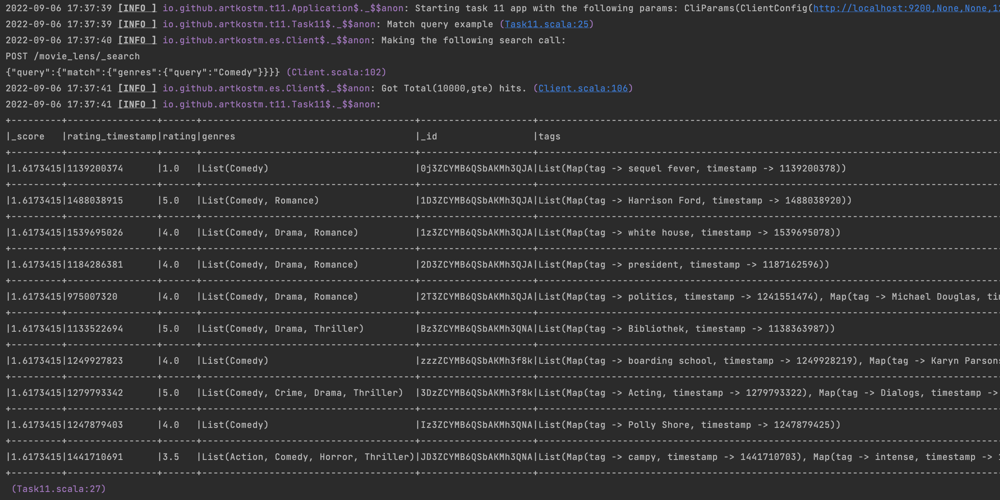

## Task 11

### Development

1. Use nix and enter the shell (`nix develop` if you have flake support, `nix-shell` otherwise), or make sure you have sbt on the PATH
2. Run sbt - after it loads, type `project t11_1 or t11_1_spark` then type `run <cli params>`. There are plenty ways to run a spark application, so it is out of scope of this task.
3. Enjoy

The first step is to create an index in ES. Here is the example:
```json
PUT movie_lens
{
    "settings": {
        "analysis": {
            "analyzer": {
                "movie_fields_analyzer": {
                    "tokenizer": "standard",
                    "filter": [
                        "asciifolding",
                        "lowercase"
                    ]
                }
            }
        }
    },
    "mappings": {
        "properties": {
            "movieId": {
                "type": "long"
            },
            "userId": {
                "type": "long"
            },
            "rating": {
                "type": "double"
            },
            "rating_timestamp": {
                "type": "date"
            },
            "title": {
                "type": "text",
                "analyzer": "movie_fields_analyzer",
                "search_analyzer": "standard"
            },
            "genres": {
                "type": "keyword"
            },
            "tags": {
                "type": "nested",
                "properties": {
                    "tag": {
                        "type": "text",
                        "analyzer": "movie_fields_analyzer",
                        "search_analyzer": "standard",
                        "fielddata":true
                    },
                    "timestamp": {
                        "type": "date"
                    }
                }
            }
        }
    }
}
```
The second step is to feed the ES index with some data. Spark module contains an application to read, join and push denormalized data to ES. This application can be run with the following cli params
```bash
"path/to/ml-25m/movies.csv" "path/to/ml-25m/tags.csv" "path/to/ml-25m/ratings.csv" "127.0.0.1" "9200" "movie_lens"
```

Console module consists of an console app implementation that executes a list of different queries.



### 1. Matching query

```shell
2022-09-06 17:37:39 [INFO ] io.github.artkostm.t11.Task11$._$$anon: Match query example (Task11.scala:25)
2022-09-06 17:37:40 [INFO ] io.github.artkostm.es.Client$._$$anon: Making the following search call: 
POST /movie_lens/_search
{"query":{"match":{"genres":{"query":"Comedy"}}}} (Client.scala:102)
2022-09-06 17:37:41 [INFO ] io.github.artkostm.es.Client$._$$anon: Got Total(10000,gte) hits. (Client.scala:106)
2022-09-06 17:37:41 [INFO ] io.github.artkostm.t11.Task11$._$$anon: 
+---------+----------------+------+--------------------------------------+--------------------+-----------------------------------------------------------------------------------------------------------------------------------------------------------------------------------------------------------------------------------------------------------------------------------------------------------------------------------------------------------------------------------------------------------+----------+------+----------------------------------+-------+
|_score   |rating_timestamp|rating|genres                                |_id                 |tags                                                                                                                                                                                                                                                                                                                                                                                                       |_index    |userId|title                             |movieId|
+---------+----------------+------+--------------------------------------+--------------------+-----------------------------------------------------------------------------------------------------------------------------------------------------------------------------------------------------------------------------------------------------------------------------------------------------------------------------------------------------------------------------------------------------------+----------+------+----------------------------------+-------+
|1.6173415|1139200374      |1.0   |List(Comedy)                          |0j3ZCYMB6QSbAKMh3QJA|List(Map(tag -> sequel fever, timestamp -> 1139200378))                                                                                                                                                                                                                                                                                                                                                    |movie_lens|13940 |Father of the Bride Part II (1995)|5      |
+---------+----------------+------+--------------------------------------+--------------------+-----------------------------------------------------------------------------------------------------------------------------------------------------------------------------------------------------------------------------------------------------------------------------------------------------------------------------------------------------------------------------------------------------------+----------+------+----------------------------------+-------+
|1.6173415|1488038915      |5.0   |List(Comedy, Romance)                 |1D3ZCYMB6QSbAKMh3QJA|List(Map(tag -> Harrison Ford, timestamp -> 1488038920))                                                                                                                                                                                                                                                                                                                                                   |movie_lens|71054 |Sabrina (1995)                    |7      |
+---------+----------------+------+--------------------------------------+--------------------+-----------------------------------------------------------------------------------------------------------------------------------------------------------------------------------------------------------------------------------------------------------------------------------------------------------------------------------------------------------------------------------------------------------+----------+------+----------------------------------+-------+
|1.6173415|1539695026      |4.0   |List(Comedy, Drama, Romance)          |1z3ZCYMB6QSbAKMh3QJA|List(Map(tag -> white house, timestamp -> 1539695078))                                                                                                                                                                                                                                                                                                                                                     |movie_lens|5572  |American President, The (1995)    |11     |
+---------+----------------+------+--------------------------------------+--------------------+-----------------------------------------------------------------------------------------------------------------------------------------------------------------------------------------------------------------------------------------------------------------------------------------------------------------------------------------------------------------------------------------------------------+----------+------+----------------------------------+-------+
|1.6173415|1184286381      |4.0   |List(Comedy, Drama, Romance)          |2D3ZCYMB6QSbAKMh3QJA|List(Map(tag -> president, timestamp -> 1187162596))                                                                                                                                                                                                                                                                                                                                                       |movie_lens|74796 |American President, The (1995)    |11     |
+---------+----------------+------+--------------------------------------+--------------------+-----------------------------------------------------------------------------------------------------------------------------------------------------------------------------------------------------------------------------------------------------------------------------------------------------------------------------------------------------------------------------------------------------------+----------+------+----------------------------------+-------+
|1.6173415|975007320       |4.0   |List(Comedy, Drama, Romance)          |2T3ZCYMB6QSbAKMh3QJA|List(Map(tag -> politics, timestamp -> 1241551474), Map(tag -> Michael Douglas, timestamp -> 1241551490), Map(tag -> Aaron Sorkin, timestamp -> 1241551460))                                                                                                                                                                                                                                               |movie_lens|79880 |American President, The (1995)    |11     |
+---------+----------------+------+--------------------------------------+--------------------+-----------------------------------------------------------------------------------------------------------------------------------------------------------------------------------------------------------------------------------------------------------------------------------------------------------------------------------------------------------------------------------------------------------+----------+------+----------------------------------+-------+
|1.6173415|1133522694      |5.0   |List(Comedy, Drama, Thriller)         |Bz3ZCYMB6QSbAKMh3QNA|List(Map(tag -> Bibliothek, timestamp -> 1138363987))                                                                                                                                                                                                                                                                                                                                                      |movie_lens|117789|To Die For (1995)                 |45     |
+---------+----------------+------+--------------------------------------+--------------------+-----------------------------------------------------------------------------------------------------------------------------------------------------------------------------------------------------------------------------------------------------------------------------------------------------------------------------------------------------------------------------------------------------------+----------+------+----------------------------------+-------+
|1.6173415|1249927823      |4.0   |List(Comedy)                          |zzzZCYMB6QSbAKMh3f8k|List(Map(tag -> boarding school, timestamp -> 1249928219), Map(tag -> Karyn Parsons, timestamp -> 1249928168), Map(tag -> comedy, timestamp -> 1249927845), Map(tag -> underdog, timestamp -> 1249927931), Map(tag -> hilarious, timestamp -> 1249928001), Map(tag -> military, timestamp -> 1249927862), Map(tag -> Damon Wayans, timestamp -> 1249927834), Map(tag -> children, timestamp -> 1249927878))|movie_lens|149463|Major Payne (1995)                |267    |
+---------+----------------+------+--------------------------------------+--------------------+-----------------------------------------------------------------------------------------------------------------------------------------------------------------------------------------------------------------------------------------------------------------------------------------------------------------------------------------------------------------------------------------------------------+----------+------+----------------------------------+-------+
|1.6173415|1279793342      |5.0   |List(Comedy, Crime, Drama, Thriller)  |3DzZCYMB6QSbAKMh3f8k|List(Map(tag -> Acting, timestamp -> 1279793322), Map(tag -> Dialogs, timestamp -> 1279793316), Map(tag -> Nothing, timestamp -> 1279793308), Map(tag -> Short Stories, timestamp -> 1279793332))                                                                                                                                                                                                          |movie_lens|521   |Pulp Fiction (1994)               |296    |
+---------+----------------+------+--------------------------------------+--------------------+-----------------------------------------------------------------------------------------------------------------------------------------------------------------------------------------------------------------------------------------------------------------------------------------------------------------------------------------------------------------------------------------------------------+----------+------+----------------------------------+-------+
|1.6173415|1247879403      |4.0   |List(Comedy)                          |Iz3ZCYMB6QSbAKMh3QNA|List(Map(tag -> Polly Shore, timestamp -> 1247879425))                                                                                                                                                                                                                                                                                                                                                     |movie_lens|75373 |Bio-Dome (1996)                   |65     |
+---------+----------------+------+--------------------------------------+--------------------+-----------------------------------------------------------------------------------------------------------------------------------------------------------------------------------------------------------------------------------------------------------------------------------------------------------------------------------------------------------------------------------------------------------+----------+------+----------------------------------+-------+
|1.6173415|1441710691      |3.5   |List(Action, Comedy, Horror, Thriller)|JD3ZCYMB6QSbAKMh3QNA|List(Map(tag -> campy, timestamp -> 1441710703), Map(tag -> intense, timestamp -> 1441710705), Map(tag -> so bad it's good, timestamp -> 1441710700))                                                                                                                                                                                                                                                      |movie_lens|35956 |From Dusk Till Dawn (1996)        |70     |
+---------+----------------+------+--------------------------------------+--------------------+-----------------------------------------------------------------------------------------------------------------------------------------------------------------------------------------------------------------------------------------------------------------------------------------------------------------------------------------------------------------------------------------------------------+----------+------+----------------------------------+-------+
```

### 2. Fuzzy query

```shell
2022-09-06 17:37:41 [INFO ] io.github.artkostm.t11.Task11$._$$anon: Fuzzy query example (Task11.scala:28)
2022-09-06 17:37:41 [INFO ] io.github.artkostm.es.Client$._$$anon: Making the following search call: 
POST /movie_lens/_search
{"query":{"fuzzy":{"genres":{"value":"auction","fuzziness":"AUTO"}}}} (Client.scala:102)
2022-09-06 17:37:41 [INFO ] io.github.artkostm.es.Client$._$$anon: Got Total(10000,gte) hits. (Client.scala:106)
2022-09-06 17:37:41 [INFO ] io.github.artkostm.t11.Task11$._$$anon: 
+---------+----------------+------+---------------------------------+--------------------+--------------------------------------------------------------------------------------------------------------------------------------------------------------------------------------------------------------------------------------------------------------------------------------------------------------------------------------------------------------------------------------------------------------------------------------------------------------------------------------------------------------------------------------------------------------------------------------------------------------------------------------------------------------------------------------------------------------------------------------------------------------------------------------------------------------------------------------------------------------------------------------------------------------------------------------------------------------------------------------------------------------------------------------------------------------------------------------------------------------------------------------------------------------------------------------------------------------------------------------------------------------------------------------------------------------------------------------------------------------------------------------------------------------------------------------------------------------------------------------------------------------------------------------------------------------------------------------------------------------------------------------------------------------------------------------------------------------------------------------------------------------------------------------------------------------------------------------------------------------------------------------------+----------+------+-----------------------------------------+-------+
|_score   |rating_timestamp|rating|genres                           |_id                 |tags                                                                                                                                                                                                                                                                                                                                                                                                                                                                                                                                                                                                                                                                                                                                                                                                                                                                                                                                                                                                                                                                                                                                                                                                                                                                                                                                                                                                                                                                                                                                                                                                                                                                                                                                                                                                                                                                                        |_index    |userId|title                                    |movieId|
+---------+----------------+------+---------------------------------+--------------------+--------------------------------------------------------------------------------------------------------------------------------------------------------------------------------------------------------------------------------------------------------------------------------------------------------------------------------------------------------------------------------------------------------------------------------------------------------------------------------------------------------------------------------------------------------------------------------------------------------------------------------------------------------------------------------------------------------------------------------------------------------------------------------------------------------------------------------------------------------------------------------------------------------------------------------------------------------------------------------------------------------------------------------------------------------------------------------------------------------------------------------------------------------------------------------------------------------------------------------------------------------------------------------------------------------------------------------------------------------------------------------------------------------------------------------------------------------------------------------------------------------------------------------------------------------------------------------------------------------------------------------------------------------------------------------------------------------------------------------------------------------------------------------------------------------------------------------------------------------------------------------------------+----------+------+-----------------------------------------+-------+
|1.1882317|1436280011      |3.5   |List(Action, Adventure, Sci-Fi)  |kTzZCYMB6QSbAKMh3f8k|List(Map(tag -> classic sci-fi, timestamp -> 1436279642), Map(tag -> space adventure, timestamp -> 1436279624), Map(tag -> sci-fi, timestamp -> 1436279617))                                                                                                                                                                                                                                                                                                                                                                                                                                                                                                                                                                                                                                                                                                                                                                                                                                                                                                                                                                                                                                                                                                                                                                                                                                                                                                                                                                                                                                                                                                                                                                                                                                                                                                                                |movie_lens|13485 |Star Wars: Episode IV - A New Hope (1977)|260    |
+---------+----------------+------+---------------------------------+--------------------+--------------------------------------------------------------------------------------------------------------------------------------------------------------------------------------------------------------------------------------------------------------------------------------------------------------------------------------------------------------------------------------------------------------------------------------------------------------------------------------------------------------------------------------------------------------------------------------------------------------------------------------------------------------------------------------------------------------------------------------------------------------------------------------------------------------------------------------------------------------------------------------------------------------------------------------------------------------------------------------------------------------------------------------------------------------------------------------------------------------------------------------------------------------------------------------------------------------------------------------------------------------------------------------------------------------------------------------------------------------------------------------------------------------------------------------------------------------------------------------------------------------------------------------------------------------------------------------------------------------------------------------------------------------------------------------------------------------------------------------------------------------------------------------------------------------------------------------------------------------------------------------------+----------+------+-----------------------------------------+-------+
|1.1882317|1439889326      |0.5   |List(Action, Adventure, Sci-Fi)  |kjzZCYMB6QSbAKMh3f8k|List(Map(tag -> sci-fi, timestamp -> 1439889308), Map(tag -> classic sci-fi, timestamp -> 1439889316))                                                                                                                                                                                                                                                                                                                                                                                                                                                                                                                                                                                                                                                                                                                                                                                                                                                                                                                                                                                                                                                                                                                                                                                                                                                                                                                                                                                                                                                                                                                                                                                                                                                                                                                                                                                      |movie_lens|15038 |Star Wars: Episode IV - A New Hope (1977)|260    |
+---------+----------------+------+---------------------------------+--------------------+--------------------------------------------------------------------------------------------------------------------------------------------------------------------------------------------------------------------------------------------------------------------------------------------------------------------------------------------------------------------------------------------------------------------------------------------------------------------------------------------------------------------------------------------------------------------------------------------------------------------------------------------------------------------------------------------------------------------------------------------------------------------------------------------------------------------------------------------------------------------------------------------------------------------------------------------------------------------------------------------------------------------------------------------------------------------------------------------------------------------------------------------------------------------------------------------------------------------------------------------------------------------------------------------------------------------------------------------------------------------------------------------------------------------------------------------------------------------------------------------------------------------------------------------------------------------------------------------------------------------------------------------------------------------------------------------------------------------------------------------------------------------------------------------------------------------------------------------------------------------------------------------+----------+------+-----------------------------------------+-------+
|1.1882317|1486956297      |3.5   |List(Action, Adventure, Sci-Fi)  |kzzZCYMB6QSbAKMh3f8k|List(Map(tag -> George Lucas, timestamp -> 1486956355), Map(tag -> sci-fi, timestamp -> 1486956312), Map(tag -> space adventure, timestamp -> 1486956324), Map(tag -> fantasy, timestamp -> 1486956338), Map(tag -> space, timestamp -> 1486956321), Map(tag -> future fantasy, timestamp -> 1486956464), Map(tag -> good versus evil, timestamp -> 1486956460), Map(tag -> Science Fiction, timestamp -> 1486956315), Map(tag -> aliens, timestamp -> 1486956393), Map(tag -> adventure, timestamp -> 1486956335), Map(tag -> Star Wars, timestamp -> 1486956332), Map(tag -> futuristic, timestamp -> 1486956374), Map(tag -> special effects, timestamp -> 1486956387), Map(tag -> classic sci-fi, timestamp -> 1486956327), Map(tag -> scifi, timestamp -> 1486956359), Map(tag -> future, timestamp -> 1486956399), Map(tag -> classic, timestamp -> 1486956318), Map(tag -> science fantasy, timestamp -> 1486956390), Map(tag -> war, timestamp -> 1486956395), Map(tag -> robots, timestamp -> 1486956411), Map(tag -> space action, timestamp -> 1486956343), Map(tag -> great soundtrack, timestamp -> 1486956402), Map(tag -> drama, timestamp -> 1486956422), Map(tag -> sci fi, timestamp -> 1486956419), Map(tag -> luke skywalker, timestamp -> 1486956434), Map(tag -> space travel, timestamp -> 1486956415), Map(tag -> darth vader, timestamp -> 1486956439), Map(tag -> action, timestamp -> 1486956329), Map(tag -> scifi cult, timestamp -> 1486956370), Map(tag -> must see, timestamp -> 1486956407), Map(tag -> sword fight, timestamp -> 1486956453), Map(tag -> action, scifi, timestamp -> 1486956385), Map(tag -> good vs evil, timestamp -> 1486956346), Map(tag -> jedi, timestamp -> 1486956363), Map(tag -> Harrison Ford, timestamp -> 1486956351), Map(tag -> lightsabers, timestamp -> 1486956445), Map(tag -> hero's journey, timestamp -> 1486956381))|movie_lens|15560 |Star Wars: Episode IV - A New Hope (1977)|260    |
+---------+----------------+------+---------------------------------+--------------------+--------------------------------------------------------------------------------------------------------------------------------------------------------------------------------------------------------------------------------------------------------------------------------------------------------------------------------------------------------------------------------------------------------------------------------------------------------------------------------------------------------------------------------------------------------------------------------------------------------------------------------------------------------------------------------------------------------------------------------------------------------------------------------------------------------------------------------------------------------------------------------------------------------------------------------------------------------------------------------------------------------------------------------------------------------------------------------------------------------------------------------------------------------------------------------------------------------------------------------------------------------------------------------------------------------------------------------------------------------------------------------------------------------------------------------------------------------------------------------------------------------------------------------------------------------------------------------------------------------------------------------------------------------------------------------------------------------------------------------------------------------------------------------------------------------------------------------------------------------------------------------------------+----------+------+-----------------------------------------+-------+
|1.1882317|1447274620      |3.5   |List(Action, Crime, Thriller)    |0z3ZCYMB6QSbAKMh3QJA|List(Map(tag -> Robert De Niro, timestamp -> 1447274634), Map(tag -> long, timestamp -> 1447274648), Map(tag -> Ashley Judd, timestamp -> 1447274933), Map(tag -> ensemble cast, timestamp -> 1447275012), Map(tag -> bleak, timestamp -> 1447274966), Map(tag -> gunfight, timestamp -> 1447274943), Map(tag -> Al Pacino, timestamp -> 1447274631), Map(tag -> police, timestamp -> 1447274657), Map(tag -> relationships, timestamp -> 1447274957), Map(tag -> too long, timestamp -> 1447274821), Map(tag -> overrated, timestamp -> 1447274672), Map(tag -> Bechdel Test:Fail, timestamp -> 1447274681), Map(tag -> dialogue, timestamp -> 1447274940))                                                                                                                                                                                                                                                                                                                                                                                                                                                                                                                                                                                                                                                                                                                                                                                                                                                                                                                                                                                                                                                                                                                                                                                                                                |movie_lens|51106 |Heat (1995)                              |6      |
+---------+----------------+------+---------------------------------+--------------------+--------------------------------------------------------------------------------------------------------------------------------------------------------------------------------------------------------------------------------------------------------------------------------------------------------------------------------------------------------------------------------------------------------------------------------------------------------------------------------------------------------------------------------------------------------------------------------------------------------------------------------------------------------------------------------------------------------------------------------------------------------------------------------------------------------------------------------------------------------------------------------------------------------------------------------------------------------------------------------------------------------------------------------------------------------------------------------------------------------------------------------------------------------------------------------------------------------------------------------------------------------------------------------------------------------------------------------------------------------------------------------------------------------------------------------------------------------------------------------------------------------------------------------------------------------------------------------------------------------------------------------------------------------------------------------------------------------------------------------------------------------------------------------------------------------------------------------------------------------------------------------------------+----------+------+-----------------------------------------+-------+
|1.1882317|1270461037      |3.5   |List(Action, Adventure, Thriller)|1j3ZCYMB6QSbAKMh3QJA|List(Map(tag -> Pierce Brosnan, timestamp -> 1270461076))                                                                                                                                                                                                                                                                                                                                                                                                                                                                                                                                                                                                                                                                                                                                                                                                                                                                                                                                                                                                                                                                                                                                                                                                                                                                                                                                                                                                                                                                                                                                                                                                                                                                                                                                                                                                                                   |movie_lens|153260|GoldenEye (1995)                         |10     |
+---------+----------------+------+---------------------------------+--------------------+--------------------------------------------------------------------------------------------------------------------------------------------------------------------------------------------------------------------------------------------------------------------------------------------------------------------------------------------------------------------------------------------------------------------------------------------------------------------------------------------------------------------------------------------------------------------------------------------------------------------------------------------------------------------------------------------------------------------------------------------------------------------------------------------------------------------------------------------------------------------------------------------------------------------------------------------------------------------------------------------------------------------------------------------------------------------------------------------------------------------------------------------------------------------------------------------------------------------------------------------------------------------------------------------------------------------------------------------------------------------------------------------------------------------------------------------------------------------------------------------------------------------------------------------------------------------------------------------------------------------------------------------------------------------------------------------------------------------------------------------------------------------------------------------------------------------------------------------------------------------------------------------+----------+------+-----------------------------------------+-------+
|1.1882317|1222687630      |4.0   |List(Action, Adventure, Sci-Fi)  |njzZCYMB6QSbAKMh3f8k|List(Map(tag -> space, timestamp -> 1242029296))                                                                                                                                                                                                                                                                                                                                                                                                                                                                                                                                                                                                                                                                                                                                                                                                                                                                                                                                                                                                                                                                                                                                                                                                                                                                                                                                                                                                                                                                                                                                                                                                                                                                                                                                                                                                                                            |movie_lens|56645 |Star Wars: Episode IV - A New Hope (1977)|260    |
+---------+----------------+------+---------------------------------+--------------------+--------------------------------------------------------------------------------------------------------------------------------------------------------------------------------------------------------------------------------------------------------------------------------------------------------------------------------------------------------------------------------------------------------------------------------------------------------------------------------------------------------------------------------------------------------------------------------------------------------------------------------------------------------------------------------------------------------------------------------------------------------------------------------------------------------------------------------------------------------------------------------------------------------------------------------------------------------------------------------------------------------------------------------------------------------------------------------------------------------------------------------------------------------------------------------------------------------------------------------------------------------------------------------------------------------------------------------------------------------------------------------------------------------------------------------------------------------------------------------------------------------------------------------------------------------------------------------------------------------------------------------------------------------------------------------------------------------------------------------------------------------------------------------------------------------------------------------------------------------------------------------------------+----------+------+-----------------------------------------+-------+
|1.1882317|1441258053      |4.0   |List(Action, Adventure, Sci-Fi)  |nzzZCYMB6QSbAKMh3f8k|List(Map(tag -> robots, timestamp -> 1441258184), Map(tag -> good vs evil, timestamp -> 1441258263), Map(tag -> lightsabers, timestamp -> 1441258278))                                                                                                                                                                                                                                                                                                                                                                                                                                                                                                                                                                                                                                                                                                                                                                                                                                                                                                                                                                                                                                                                                                                                                                                                                                                                                                                                                                                                                                                                                                                                                                                                                                                                                                                                      |movie_lens|59770 |Star Wars: Episode IV - A New Hope (1977)|260    |
+---------+----------------+------+---------------------------------+--------------------+--------------------------------------------------------------------------------------------------------------------------------------------------------------------------------------------------------------------------------------------------------------------------------------------------------------------------------------------------------------------------------------------------------------------------------------------------------------------------------------------------------------------------------------------------------------------------------------------------------------------------------------------------------------------------------------------------------------------------------------------------------------------------------------------------------------------------------------------------------------------------------------------------------------------------------------------------------------------------------------------------------------------------------------------------------------------------------------------------------------------------------------------------------------------------------------------------------------------------------------------------------------------------------------------------------------------------------------------------------------------------------------------------------------------------------------------------------------------------------------------------------------------------------------------------------------------------------------------------------------------------------------------------------------------------------------------------------------------------------------------------------------------------------------------------------------------------------------------------------------------------------------------+----------+------+-----------------------------------------+-------+
|1.1882317|1430432259      |3.5   |List(Action, Adventure, Sci-Fi)  |ojzZCYMB6QSbAKMh3f8k|List(Map(tag -> fantasy, timestamp -> 1430432294), Map(tag -> adventure, timestamp -> 1430432298), Map(tag -> sci-fi, timestamp -> 1430432282))                                                                                                                                                                                                                                                                                                                                                                                                                                                                                                                                                                                                                                                                                                                                                                                                                                                                                                                                                                                                                                                                                                                                                                                                                                                                                                                                                                                                                                                                                                                                                                                                                                                                                                                                             |movie_lens|72865 |Star Wars: Episode IV - A New Hope (1977)|260    |
+---------+----------------+------+---------------------------------+--------------------+--------------------------------------------------------------------------------------------------------------------------------------------------------------------------------------------------------------------------------------------------------------------------------------------------------------------------------------------------------------------------------------------------------------------------------------------------------------------------------------------------------------------------------------------------------------------------------------------------------------------------------------------------------------------------------------------------------------------------------------------------------------------------------------------------------------------------------------------------------------------------------------------------------------------------------------------------------------------------------------------------------------------------------------------------------------------------------------------------------------------------------------------------------------------------------------------------------------------------------------------------------------------------------------------------------------------------------------------------------------------------------------------------------------------------------------------------------------------------------------------------------------------------------------------------------------------------------------------------------------------------------------------------------------------------------------------------------------------------------------------------------------------------------------------------------------------------------------------------------------------------------------------+----------+------+-----------------------------------------+-------+
|1.1882317|1441584020      |4.5   |List(Action, Adventure, Sci-Fi)  |qDzZCYMB6QSbAKMh3f8k|List(Map(tag -> Science Fiction, timestamp -> 1441584031), Map(tag -> robots, timestamp -> 1441584037), Map(tag -> space opera, timestamp -> 1441584044))                                                                                                                                                                                                                                                                                                                                                                                                                                                                                                                                                                                                                                                                                                                                                                                                                                                                                                                                                                                                                                                                                                                                                                                                                                                                                                                                                                                                                                                                                                                                                                                                                                                                                                                                   |movie_lens|89851 |Star Wars: Episode IV - A New Hope (1977)|260    |
+---------+----------------+------+---------------------------------+--------------------+--------------------------------------------------------------------------------------------------------------------------------------------------------------------------------------------------------------------------------------------------------------------------------------------------------------------------------------------------------------------------------------------------------------------------------------------------------------------------------------------------------------------------------------------------------------------------------------------------------------------------------------------------------------------------------------------------------------------------------------------------------------------------------------------------------------------------------------------------------------------------------------------------------------------------------------------------------------------------------------------------------------------------------------------------------------------------------------------------------------------------------------------------------------------------------------------------------------------------------------------------------------------------------------------------------------------------------------------------------------------------------------------------------------------------------------------------------------------------------------------------------------------------------------------------------------------------------------------------------------------------------------------------------------------------------------------------------------------------------------------------------------------------------------------------------------------------------------------------------------------------------------------+----------+------+-----------------------------------------+-------+
|1.1882317|1224123330      |4.5   |List(Action, Adventure, Sci-Fi)  |qjzZCYMB6QSbAKMh3f8k|List(Map(tag -> atmospheric, timestamp -> 1251406527), Map(tag -> space, timestamp -> 1251406511), Map(tag -> stylized, timestamp -> 1251406517), Map(tag -> sci-fi, timestamp -> 1251406510), Map(tag -> Star Wars, timestamp -> 1251406514), Map(tag -> Akira Kurosawa, timestamp -> 1251406525), Map(tag -> Harrison Ford, timestamp -> 1251406510), Map(tag -> adventure, timestamp -> 1251406523), Map(tag -> action, timestamp -> 1251406521))                                                                                                                                                                                                                                                                                                                                                                                                                                                                                                                                                                                                                                                                                                                                                                                                                                                                                                                                                                                                                                                                                                                                                                                                                                                                                                                                                                                                                                        |movie_lens|90691 |Star Wars: Episode IV - A New Hope (1977)|260    |
+---------+----------------+------+---------------------------------+--------------------+--------------------------------------------------------------------------------------------------------------------------------------------------------------------------------------------------------------------------------------------------------------------------------------------------------------------------------------------------------------------------------------------------------------------------------------------------------------------------------------------------------------------------------------------------------------------------------------------------------------------------------------------------------------------------------------------------------------------------------------------------------------------------------------------------------------------------------------------------------------------------------------------------------------------------------------------------------------------------------------------------------------------------------------------------------------------------------------------------------------------------------------------------------------------------------------------------------------------------------------------------------------------------------------------------------------------------------------------------------------------------------------------------------------------------------------------------------------------------------------------------------------------------------------------------------------------------------------------------------------------------------------------------------------------------------------------------------------------------------------------------------------------------------------------------------------------------------------------------------------------------------------------+----------+------+-----------------------------------------+-------+
 
```

### 3. Top Rated Movies By user 6285
```shell
2022-09-06 17:37:41 [INFO ] io.github.artkostm.t11.Task11$._$$anon: Top Rated Movies example (Task11.scala:31)
2022-09-06 17:37:41 [INFO ] io.github.artkostm.es.Client$._$$anon: Making the following search call: 
POST /movie_lens/_search
{"query":{"bool":{"must":[{"match":{"userId":{"query":"6285"}}},{"range":{"rating":{"gte":5}}}]}}} (Client.scala:102)
2022-09-06 17:37:41 [INFO ] io.github.artkostm.es.Client$._$$anon: Got Total(10,eq) hits. (Client.scala:106)
2022-09-06 17:37:41 [INFO ] io.github.artkostm.t11.Task11$._$$anon: 
+------+----------------+------+--------------------------------------+--------------------+--------------------------------------------------------------------------------------------------------------------------------------------------------------------------------------------------------------------------------------------------------------------------------------------------------------------------------------------------------------------------------------------------------------------------------------------------------------------------------------------------------------------------------------------------------------------------------------------------------------------------------+----------+------+------------------------------------------------------------------------------+-------+
|_score|rating_timestamp|rating|genres                                |_id                 |tags                                                                                                                                                                                                                                                                                                                                                                                                                                                                                                                                                                                                                            |_index    |userId|title                                                                         |movieId|
+------+----------------+------+--------------------------------------+--------------------+--------------------------------------------------------------------------------------------------------------------------------------------------------------------------------------------------------------------------------------------------------------------------------------------------------------------------------------------------------------------------------------------------------------------------------------------------------------------------------------------------------------------------------------------------------------------------------------------------------------------------------+----------+------+------------------------------------------------------------------------------+-------+
|2.0   |1170538748      |5.0   |List(Comedy)                          |TD3ZCYMB6QSbAKMh3wsK|List(Map(tag -> PARENTHOOD, timestamp -> 1172498581), Map(tag -> satirical, timestamp -> 1171146911), Map(tag -> KIDNAPPING, timestamp -> 1172498574), Map(tag -> UNLIKELY CRIMINALS, timestamp -> 1172498562), Map(tag -> quirky, timestamp -> 1171146935), Map(tag -> witty, timestamp -> 1171146884), Map(tag -> frantic, timestamp -> 1171146892), Map(tag -> deadpan, timestamp -> 1171146899), Map(tag -> madcap, timestamp -> 1171146824), Map(tag -> ESCAPE FROM PRISON, timestamp -> 1172498595), Map(tag -> goofy, timestamp -> 1171146904))                                                                          |movie_lens|6285  |Raising Arizona (1987)                                                        |1394   |
+------+----------------+------+--------------------------------------+--------------------+--------------------------------------------------------------------------------------------------------------------------------------------------------------------------------------------------------------------------------------------------------------------------------------------------------------------------------------------------------------------------------------------------------------------------------------------------------------------------------------------------------------------------------------------------------------------------------------------------------------------------------+----------+------+------------------------------------------------------------------------------+-------+
|2.0   |1172349482      |5.0   |List(Comedy)                          |5j3ZCYMB6QSbAKMh6boU|List(Map(tag -> goofy, timestamp -> 1171147355), Map(tag -> NOTHING GOES RIGHT, timestamp -> 1172499106), Map(tag -> irreverent, timestamp -> 1171147362), Map(tag -> UNLIKELY HEROES, timestamp -> 1172499100), Map(tag -> quirky, timestamp -> 1171147369), Map(tag -> satirical, timestamp -> 1171147380), Map(tag -> humorous, timestamp -> 1171147348), Map(tag -> UNREQUITED LOVE, timestamp -> 1172499116))                                                                                                                                                                                                              |movie_lens|6285  |Love and Death (1975)                                                         |3814   |
+------+----------------+------+--------------------------------------+--------------------+--------------------------------------------------------------------------------------------------------------------------------------------------------------------------------------------------------------------------------------------------------------------------------------------------------------------------------------------------------------------------------------------------------------------------------------------------------------------------------------------------------------------------------------------------------------------------------------------------------------------------------+----------+------+------------------------------------------------------------------------------+-------+
|2.0   |1172349508      |5.0   |List(Drama, Mystery, Thriller)        |dD3ZCYMB6QSbAKMh56TP|List(Map(tag -> sexual, timestamp -> 1171148043), Map(tag -> atmospheric, timestamp -> 1171148025), Map(tag -> WOMEN IN JEOPARDY, timestamp -> 1172499743), Map(tag -> dreamlike, timestamp -> 1171148053), Map(tag -> INNOCENCE LOST, timestamp -> 1172499706), Map(tag -> menacing, timestamp -> 1171148039), Map(tag -> AMATEUR SLEUTHS, timestamp -> 1172499732), Map(tag -> disturbing, timestamp -> 1171148018), Map(tag -> quirky, timestamp -> 1171148075), Map(tag -> ominous, timestamp -> 1171148059), Map(tag -> SUBURBAN DYSFUNCTION, timestamp -> 1172499715), Map(tag -> hallucinatory, timestamp -> 1171148033))|movie_lens|6285  |Blue Velvet (1986)                                                            |2076   |
+------+----------------+------+--------------------------------------+--------------------+--------------------------------------------------------------------------------------------------------------------------------------------------------------------------------------------------------------------------------------------------------------------------------------------------------------------------------------------------------------------------------------------------------------------------------------------------------------------------------------------------------------------------------------------------------------------------------------------------------------------------------+----------+------+------------------------------------------------------------------------------+-------+
|2.0   |1171860992      |5.0   |List(Drama, Mystery, Sci-Fi, Thriller)|fD7aCYMB6QSbAKMhAsTd|List(Map(tag -> grim, timestamp -> 1171151312), Map(tag -> TOTALITARIAN STATES, timestamp -> 1172498402), Map(tag -> bleak, timestamp -> 1171151307), Map(tag -> atmospheric, timestamp -> 1171151302), Map(tag -> FUTURE DYSTOPIAS, timestamp -> 1172498378), Map(tag -> FIGHTING THE SYSTEM, timestamp -> 1172498391))                                                                                                                                                                                                                                                                                                        |movie_lens|6285  |Soylent Green (1973)                                                          |2009   |
+------+----------------+------+--------------------------------------+--------------------+--------------------------------------------------------------------------------------------------------------------------------------------------------------------------------------------------------------------------------------------------------------------------------------------------------------------------------------------------------------------------------------------------------------------------------------------------------------------------------------------------------------------------------------------------------------------------------------------------------------------------------+----------+------+------------------------------------------------------------------------------+-------+
|2.0   |1171860989      |5.0   |List(Horror)                          |SD_aCYMB6QSbAKMhEDzE|List(Map(tag -> WITCHCRAFT, timestamp -> 1172498332), Map(tag -> atmospheric, timestamp -> 1171147032), Map(tag -> ominous, timestamp -> 1171147087), Map(tag -> dreamlike, timestamp -> 1171147041), Map(tag -> stylized, timestamp -> 1171147023), Map(tag -> WOMEN IN JEOPARDY, timestamp -> 1172498343), Map(tag -> creepy, timestamp -> 1171147066), Map(tag -> hallucinatory, timestamp -> 1171147076), Map(tag -> eerie, timestamp -> 1171147050), Map(tag -> slick, timestamp -> 1171147057))                                                                                                                           |movie_lens|6285  |Suspiria (1977)                                                               |4437   |
+------+----------------+------+--------------------------------------+--------------------+--------------------------------------------------------------------------------------------------------------------------------------------------------------------------------------------------------------------------------------------------------------------------------------------------------------------------------------------------------------------------------------------------------------------------------------------------------------------------------------------------------------------------------------------------------------------------------------------------------------------------------+----------+------+------------------------------------------------------------------------------+-------+
|2.0   |1171860984      |5.0   |List(Crime, Drama, Thriller)          |4D7aCYMB6QSbAKMhAsru|List(Map(tag -> grim, timestamp -> 1171709233), Map(tag -> OBSESSIVE QUESTS, timestamp -> 1172498140), Map(tag -> forceful, timestamp -> 1171709255), Map(tag -> ASSASSINATION PLOTS, timestamp -> 1172498128), Map(tag -> PROSTITUTES, timestamp -> 1172498149), Map(tag -> lurid, timestamp -> 1171709264), Map(tag -> paranoid, timestamp -> 1171709230), Map(tag -> UNREQUITED LOVE, timestamp -> 1172498162), Map(tag -> disturbing, timestamp -> 1171709246), Map(tag -> menacing, timestamp -> 1171709259), Map(tag -> visceral, timestamp -> 1171709242))                                                               |movie_lens|6285  |Taxi Driver (1976)                                                            |111    |
+------+----------------+------+--------------------------------------+--------------------+--------------------------------------------------------------------------------------------------------------------------------------------------------------------------------------------------------------------------------------------------------------------------------------------------------------------------------------------------------------------------------------------------------------------------------------------------------------------------------------------------------------------------------------------------------------------------------------------------------------------------------+----------+------+------------------------------------------------------------------------------+-------+
|2.0   |1172043417      |5.0   |List(Action, Adventure, Western)      |Cj7aCYMB6QSbAKMhCfgr|List(Map(tag -> POLITICAL UNREST, timestamp -> 1172499244), Map(tag -> LONE WOLVES, timestamp -> 1172499223), Map(tag -> irreverent, timestamp -> 1172210873), Map(tag -> quirky, timestamp -> 1172210877), Map(tag -> BOUNTY HUNTERS, timestamp -> 1172499215), Map(tag -> humorous, timestamp -> 1172210869), Map(tag -> TREASURE HUNTS, timestamp -> 1172499234), Map(tag -> satirical, timestamp -> 1172210881))                                                                                                                                                                                                            |movie_lens|6285  |Good, the Bad and the Ugly, The (Buono, il brutto, il cattivo, Il) (1966)     |1201   |
+------+----------------+------+--------------------------------------+--------------------+--------------------------------------------------------------------------------------------------------------------------------------------------------------------------------------------------------------------------------------------------------------------------------------------------------------------------------------------------------------------------------------------------------------------------------------------------------------------------------------------------------------------------------------------------------------------------------------------------------------------------------+----------+------+------------------------------------------------------------------------------+-------+
|2.0   |1171861703      |5.0   |List(Action, Adventure)               |OD3ZCYMB6QSbAKMh3QIn|List(Map(tag -> HEROIC MISSION, timestamp -> 1172498654), Map(tag -> TREASURE HUNTS, timestamp -> 1172498634), Map(tag -> lavish, timestamp -> 1171147151), Map(tag -> humorous, timestamp -> 1171147177), Map(tag -> atmospheric, timestamp -> 1171147171), Map(tag -> rousing, timestamp -> 1171147163), Map(tag -> light, timestamp -> 1171147157))                                                                                                                                                                                                                                                                          |movie_lens|6285  |Raiders of the Lost Ark (Indiana Jones and the Raiders of the Lost Ark) (1981)|1198   |
+------+----------------+------+--------------------------------------+--------------------+--------------------------------------------------------------------------------------------------------------------------------------------------------------------------------------------------------------------------------------------------------------------------------------------------------------------------------------------------------------------------------------------------------------------------------------------------------------------------------------------------------------------------------------------------------------------------------------------------------------------------------+----------+------+------------------------------------------------------------------------------+-------+
|2.0   |1172043405      |5.0   |List(Drama, Western)                  |UD3ZCYMB6QSbAKMh4B4V|List(Map(tag -> poignant, timestamp -> 1171147943), Map(tag -> lyrical, timestamp -> 1171147955), Map(tag -> STAR-CROSSED LOVERS, timestamp -> 1172499040), Map(tag -> UNREQUITED LOVE, timestamp -> 1172499025), Map(tag -> DRUG ADDICTION, timestamp -> 1172499050), Map(tag -> PROSTITUTES, timestamp -> 1258738299), Map(tag -> wry, timestamp -> 1171147950), Map(tag -> meditative, timestamp -> 1171147931), Map(tag -> FIGHTING THE SYSTEM, timestamp -> 1172499017), Map(tag -> understated, timestamp -> 1171147915), Map(tag -> atmospheric, timestamp -> 1171147923))                                               |movie_lens|6285  |McCabe & Mrs. Miller (1971)                                                   |3093   |
+------+----------------+------+--------------------------------------+--------------------+--------------------------------------------------------------------------------------------------------------------------------------------------------------------------------------------------------------------------------------------------------------------------------------------------------------------------------------------------------------------------------------------------------------------------------------------------------------------------------------------------------------------------------------------------------------------------------------------------------------------------------+----------+------+------------------------------------------------------------------------------+-------+
|2.0   |1259101570      |5.0   |List(Drama)                           |Hz7ZCYMB6QSbAKMh_3ll|List(Map(tag -> earnest, timestamp -> 1171173879), Map(tag -> sentimental, timestamp -> 1171173662), Map(tag -> DOWN ON THEIR LUCK, timestamp -> 1172498819), Map(tag -> Giulietta Masina, timestamp -> 1272024702), Map(tag -> compassionate, timestamp -> 1171173852), Map(tag -> affectionate, timestamp -> 1171173680), Map(tag -> poignant, timestamp -> 1171173872), Map(tag -> matter-of-fact, timestamp -> 1171173863), Map(tag -> bittersweet, timestamp -> 1171173669), Map(tag -> PROSTITUTES, timestamp -> 1172498798), Map(tag -> ROMANTIC BETRAYAL, timestamp -> 1172498832))                                     |movie_lens|6285  |Nights of Cabiria (Notti di Cabiria, Le) (1957)                               |2351   |
+------+----------------+------+--------------------------------------+--------------------+--------------------------------------------------------------------------------------------------------------------------------------------------------------------------------------------------------------------------------------------------------------------------------------------------------------------------------------------------------------------------------------------------------------------------------------------------------------------------------------------------------------------------------------------------------------------------------------------------------------------------------+----------+------+------------------------------------------------------------------------------+-------+

```

### 4. Nested query example
```shell
2022-09-06 17:37:41 [INFO ] io.github.artkostm.t11.Task11$._$$anon: Nested query example (Task11.scala:34)
2022-09-06 17:37:41 [INFO ] io.github.artkostm.es.Client$._$$anon: Making the following search call: 
POST /movie_lens/_search
{"query":{"nested":{"path":"tags","query":{"match":{"tags.tag":{"query":"good"}}}}}} (Client.scala:102)
2022-09-06 17:37:41 [INFO ] io.github.artkostm.es.Client$._$$anon: Got Total(5247,eq) hits. (Client.scala:106)
2022-09-06 17:37:41 [INFO ] io.github.artkostm.t11.Task11$._$$anon: 
+--------+----------------+------+--------------------------------------------------+--------------------+----------------------------------------------------------------------------------------------------------------------------------------------------------------------------------------------------------------------------------------------------+----------+------+---------------------------------------------------+-------+
|_score  |rating_timestamp|rating|genres                                            |_id                 |tags                                                                                                                                                                                                                                                |_index    |userId|title                                              |movieId|
+--------+----------------+------+--------------------------------------------------+--------------------+----------------------------------------------------------------------------------------------------------------------------------------------------------------------------------------------------------------------------------------------------+----------+------+---------------------------------------------------+-------+
|5.937636|1140601928      |2.0   |List(Comedy)                                      |Tj3ZCYMB6QSbAKMh3gjn|List(Map(tag -> good, timestamp -> 1140602254))                                                                                                                                                                                                     |movie_lens|63862 |Robin Hood: Men in Tights (1993)                   |520    |
+--------+----------------+------+--------------------------------------------------+--------------------+----------------------------------------------------------------------------------------------------------------------------------------------------------------------------------------------------------------------------------------------------+----------+------+---------------------------------------------------+-------+
|5.937636|1140376525      |4.5   |List(Action, Adventure, Sci-Fi)                   |1z3ZCYMB6QSbAKMh5nw1|List(Map(tag -> good, timestamp -> 1140376527))                                                                                                                                                                                                     |movie_lens|152983|Star Wars: Episode VI - Return of the Jedi (1983)  |1210   |
+--------+----------------+------+--------------------------------------------------+--------------------+----------------------------------------------------------------------------------------------------------------------------------------------------------------------------------------------------------------------------------------------------+----------+------+---------------------------------------------------+-------+
|5.937636|1139336476      |3.0   |List(Drama)                                       |FT3ZCYMB6QSbAKMh6K0e|List(Map(tag -> good, timestamp -> 1139336486))                                                                                                                                                                                                     |movie_lens|151677|Karate Kid, The (1984)                             |2420   |
+--------+----------------+------+--------------------------------------------------+--------------------+----------------------------------------------------------------------------------------------------------------------------------------------------------------------------------------------------------------------------------------------------+----------+------+---------------------------------------------------+-------+
|5.937636|1137726591      |3.5   |List(Comedy, Drama, Thriller)                     |7j3ZCYMB6QSbAKMh4Sk6|List(Map(tag -> good, timestamp -> 1137726605))                                                                                                                                                                                                     |movie_lens|12509 |Poolhall Junkies (2002)                            |6193   |
+--------+----------------+------+--------------------------------------------------+--------------------+----------------------------------------------------------------------------------------------------------------------------------------------------------------------------------------------------------------------------------------------------+----------+------+---------------------------------------------------+-------+
|5.937636|1491478440      |5.0   |List(Comedy, Romance)                             |Tj3ZCYMB6QSbAKMh4Sw7|List(Map(tag -> ballroom dancing, timestamp -> 1531740800), Map(tag -> romance, timestamp -> 1531740819), Map(tag -> music, timestamp -> 1531740818), Map(tag -> Stanley Tucci, timestamp -> 1531740823), Map(tag -> good, timestamp -> 1531740801))|movie_lens|53837 |Shall We Dance? (2004)                             |8916   |
+--------+----------------+------+--------------------------------------------------+--------------------+----------------------------------------------------------------------------------------------------------------------------------------------------------------------------------------------------------------------------------------------------+----------+------+---------------------------------------------------+-------+
|5.937636|1185765422      |3.5   |List(Drama, Romance, War)                         |uj3ZCYMB6QSbAKMh5GNP|List(Map(tag -> WWII, timestamp -> 1185516627), Map(tag -> good, timestamp -> 1185516681), Map(tag -> long, timestamp -> 1185516627), Map(tag -> love story, timestamp -> 1185516627), Map(tag -> burn victim, timestamp -> 1185516627))            |movie_lens|12701 |English Patient, The (1996)                        |1183   |
+--------+----------------+------+--------------------------------------------------+--------------------+----------------------------------------------------------------------------------------------------------------------------------------------------------------------------------------------------------------------------------------------------+----------+------+---------------------------------------------------+-------+
|5.937636|1227108957      |5.0   |List(Action, Adventure, Crime, Thriller)          |7T3ZCYMB6QSbAKMh5oCc|List(Map(tag -> good, timestamp -> 1238230805))                                                                                                                                                                                                     |movie_lens|4430  |Live Free or Die Hard (2007)                       |53972  |
+--------+----------------+------+--------------------------------------------------+--------------------+----------------------------------------------------------------------------------------------------------------------------------------------------------------------------------------------------------------------------------------------------+----------+------+---------------------------------------------------+-------+
|5.937636|1232160870      |3.5   |List(Adventure, Children, Sci-Fi)                 |Yj3ZCYMB6QSbAKMh540C|List(Map(tag -> escapist action, timestamp -> 1186779130), Map(tag -> good, timestamp -> 1186779130))                                                                                                                                               |movie_lens|11747 |Flight of the Navigator (1986)                     |2046   |
+--------+----------------+------+--------------------------------------------------+--------------------+----------------------------------------------------------------------------------------------------------------------------------------------------------------------------------------------------------------------------------------------------+----------+------+---------------------------------------------------+-------+
|5.937636|1152571454      |5.0   |List(Action, Adventure, Children, Comedy, Fantasy)|Rz3ZCYMB6QSbAKMh56TP|List(Map(tag -> good, timestamp -> 1161647038), Map(tag -> the truffle shuffle, timestamp -> 1158437835))                                                                                                                                           |movie_lens|36535 |Goonies, The (1985)                                |2005   |
+--------+----------------+------+--------------------------------------------------+--------------------+----------------------------------------------------------------------------------------------------------------------------------------------------------------------------------------------------------------------------------------------------+----------+------+---------------------------------------------------+-------+
|5.937636|1044318273      |4.0   |List(Action, Comedy, Sci-Fi)                      |5D3ZCYMB6QSbAKMh6bwX|List(Map(tag -> good, timestamp -> 1138341348), Map(tag -> intriguing, timestamp -> 1138341349))                                                                                                                                                    |movie_lens|18023 |Men in Black II (a.k.a. MIIB) (a.k.a. MIB 2) (2002)|5459   |
+--------+----------------+------+--------------------------------------------------+--------------------+----------------------------------------------------------------------------------------------------------------------------------------------------------------------------------------------------------------------------------------------------+----------+------+---------------------------------------------------+-------+
```

### 5. Top 10 tags for a movie example
```shell
2022-09-06 17:37:41 [INFO ] io.github.artkostm.t11.Task11$._$$anon: Top 10 tags for a movie example (Task11.scala:37)
2022-09-06 17:37:41 [INFO ] io.github.artkostm.es.Client$._$$anon: Making the following search call: 
POST /movie_lens/_search
{"query":{"bool":{"must":[{"match_phrase":{"title":{"query":"Terminator"}}}]}},"size":0,"aggs":{"top_10_tags":{"nested":{"path":"tags"},"aggs":{"top_10_tags_for_Terminator":{"terms":{"field":"tags.tag","size":10}}}}}} (Client.scala:102)
2022-09-06 17:37:41 [INFO ] io.github.artkostm.es.Client$._$$anon: Got Total(597,eq) hits. (Client.scala:106)
2022-09-06 17:37:42 [INFO ] io.github.artkostm.t11.Task11$._$$anon: 
+--------------+---------+
|key           |doc_count|
+--------------+---------+
|arnold        |239      |
+--------------+---------+
|time          |194      |
+--------------+---------+
|travel        |191      |
+--------------+---------+
|schwarzenegger|182      |
+--------------+---------+
|fi            |177      |
+--------------+---------+
|sci           |177      |
+--------------+---------+
|action        |146      |
+--------------+---------+
|artificial    |143      |
+--------------+---------+
|intelligence  |142      |
+--------------+---------+
|robots        |105      |
+--------------+---------+
```

Application side join and data denormalization is a good fit for indexing the movie lens dataset and making the search queries from above.
I decided to avoid using joined or parent-child relation (and use nesting or/and flattening the data) as the structure of movie data does not conform this type of relations and the search operations do not require any updates in the data.
Usually, nested are faster than parent/child relationship on read operations and are more simple to manage. Infact you can index child without parents, 
so you have to be careful when you index. Also, when you want to delete one entry of parent you have to delete all the children node, 
is not an automatic task. On the other hand, parent/child are more comfortable if you would to change/update your entry. 
With nested type you can't change only one nested value in the nested field, you have to reindex all the nested values in the nested field. 
With parent/child you can change/update also only one value in that parent or child field. Nested are considered as atomical relational data in the index, 
instead parent/child are only a different datatype that keep the relations from 2 field - parent, child. Parent/child is good if it is important to avoid data duplication/redundancy.