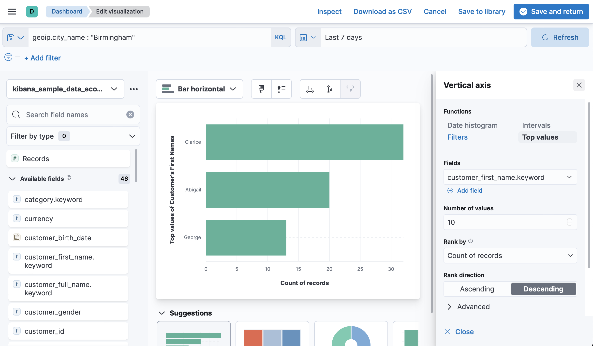
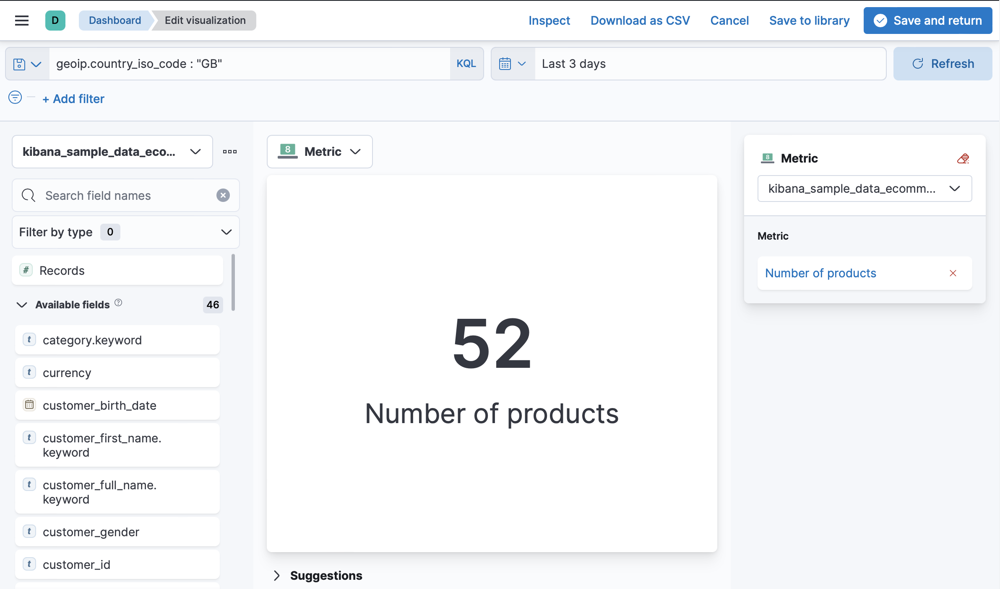
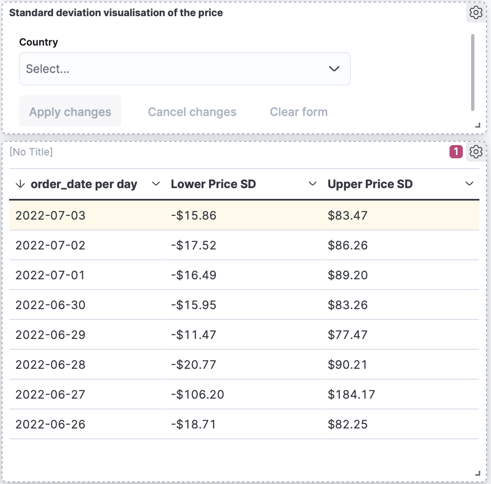
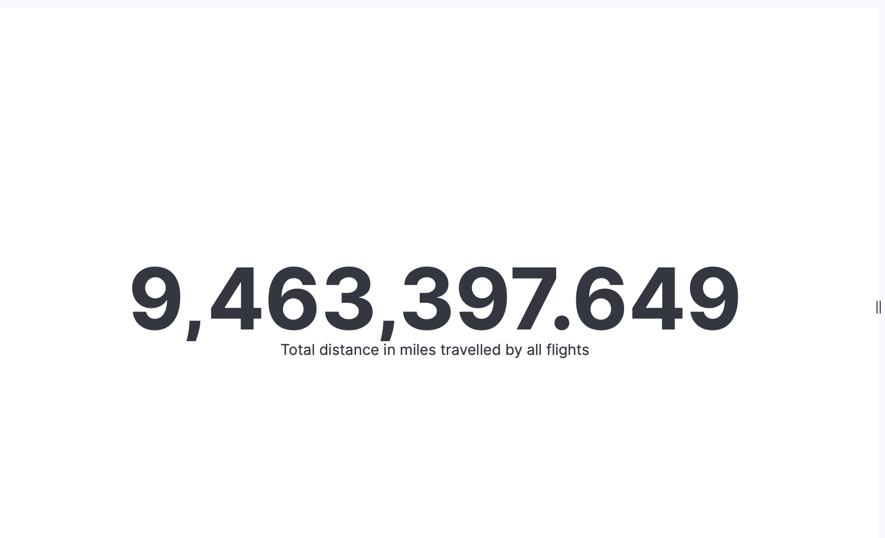
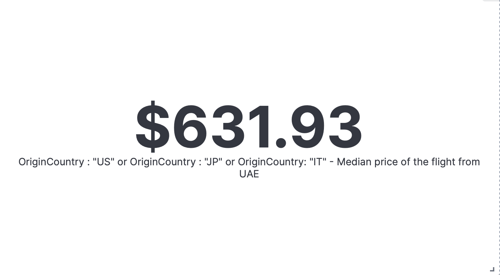
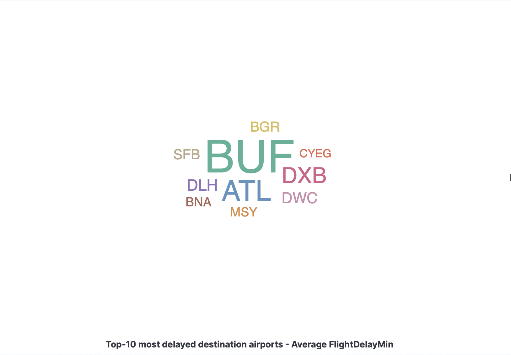
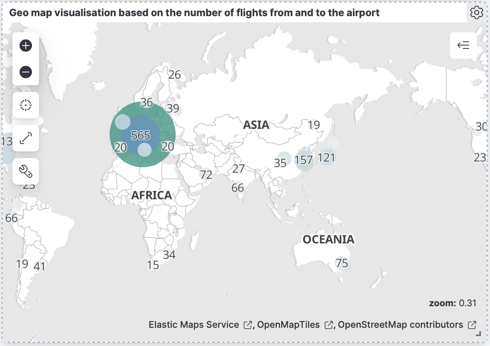
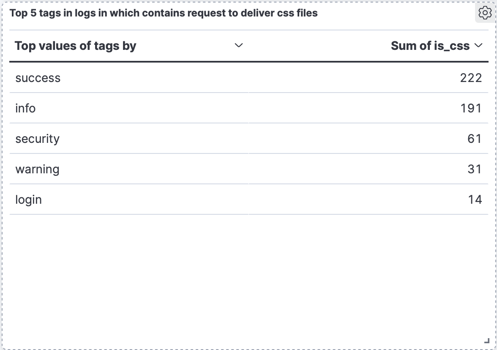
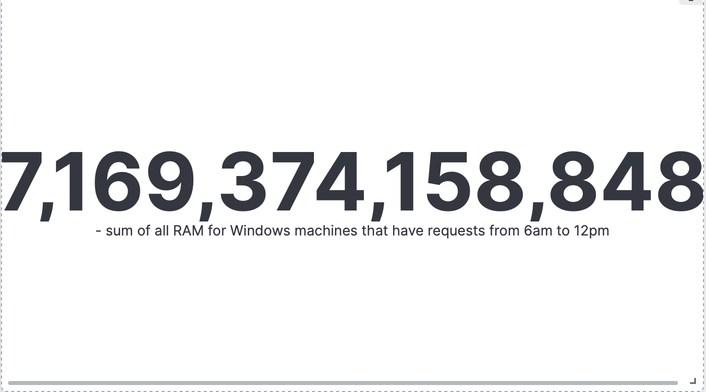
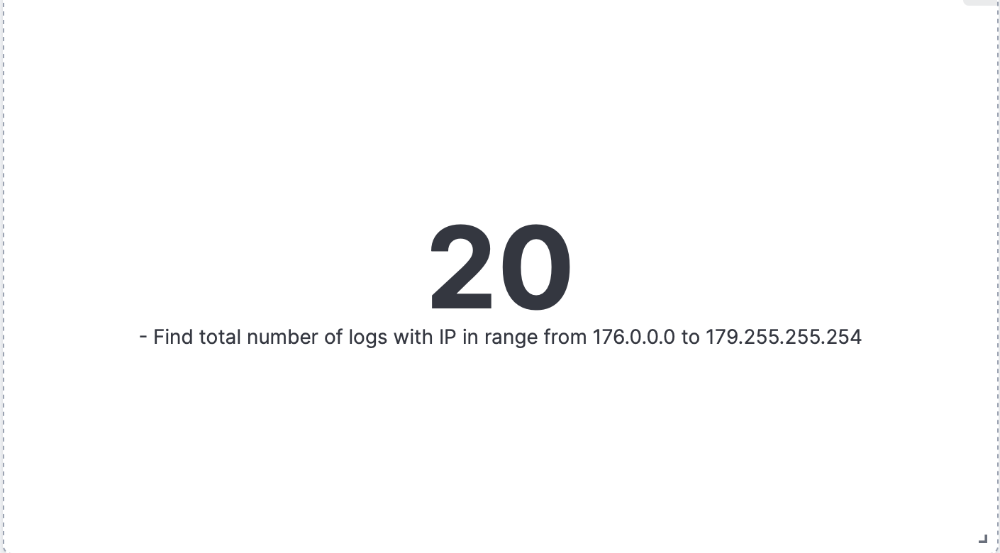

## Ecommerce data

### 1. Find top-10 most common first name of the customers from Birmingham

### 2. What is the busiest day for women buying products cheaper than 75$

### 3. How many products were bought in the last 3 days from Great Britain?

### 4. Standard deviation visualisation of the price with ability to filter by country

## Flights data

### 1. Total distance in miles travelled by all flights

### 2. Median price of the flight from Japan, US and Italy

### 3. Top-10 most delayed destination airports

### 4. Geo map visualisation based on the number of flights from and to the airport

## Logs data

### 1. Top 5 tags in logs in which contains request to deliver css files

### 2. What is sum of all RAM for Windows machines that have requests from 6am to 12pm

### 3. Find total number of logs with IP in range from 176.0.0.0 to 179.255.255.254

