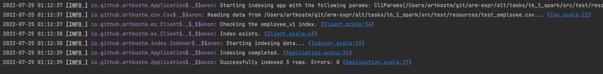
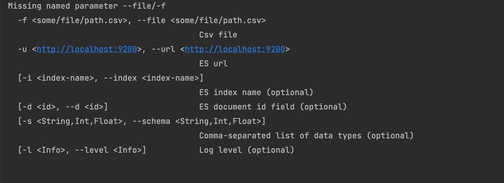
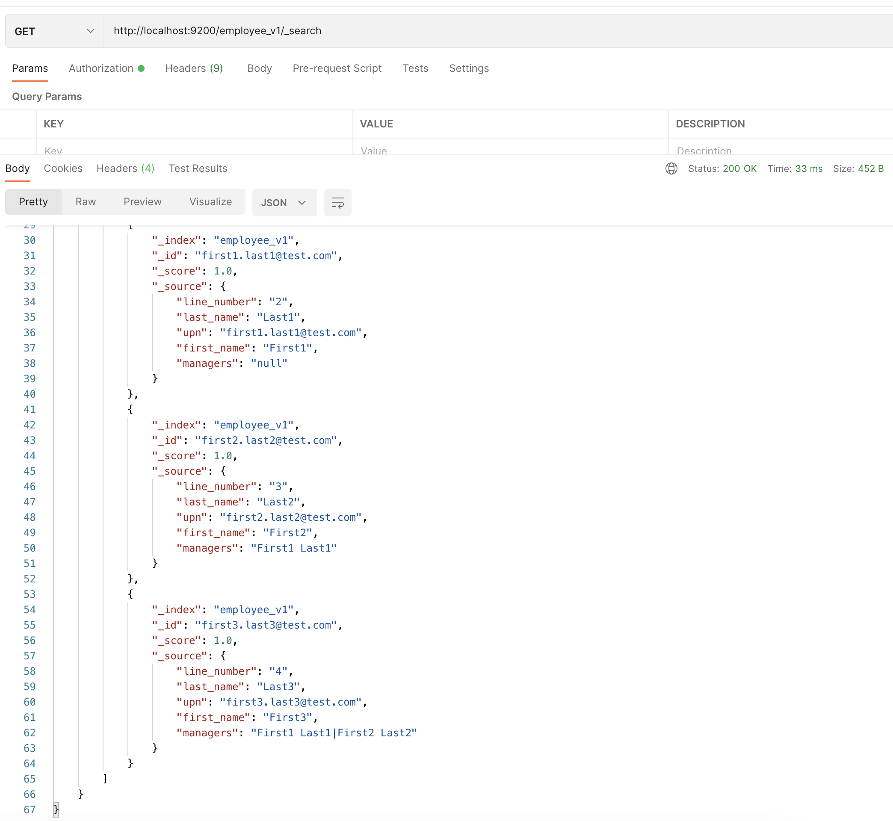

## Task 6.1

### Development

1. Use nix and enter the shell (`nix develop` if you have flake support, `nix-shell` otherwise), or make sure you have sbt on the PATH
2. Run sbt - after it loads, type `project t6_1` then type `run <cli params>`
3. Enjoy

### Results

To run the program please go through the Development list above and run this command:
```bash
run -f "tasks/t6_1_spark/src/test/resources/test_employee.csv" -u "http://localhost:9200" -i employee_v1 -d upn
```
or publish the jar file and run it just like regular java program (<small>todo - add the Native Packager plugin</small>)

The input csv file:


You will see the following output:


In case of wrong params, the app prints help instructions:


The search API output for the employee_v1 index:


Also, I wanted to try some other ways to upload arbitrary csv data (using pipelines). The sources are available in ingest_csv.sh. Same can be done using any ES client.

And as a data engineer, I just had to play around with the Spark <-> ES integration. Please have a look at the `tasks/t6_1_spark` module.