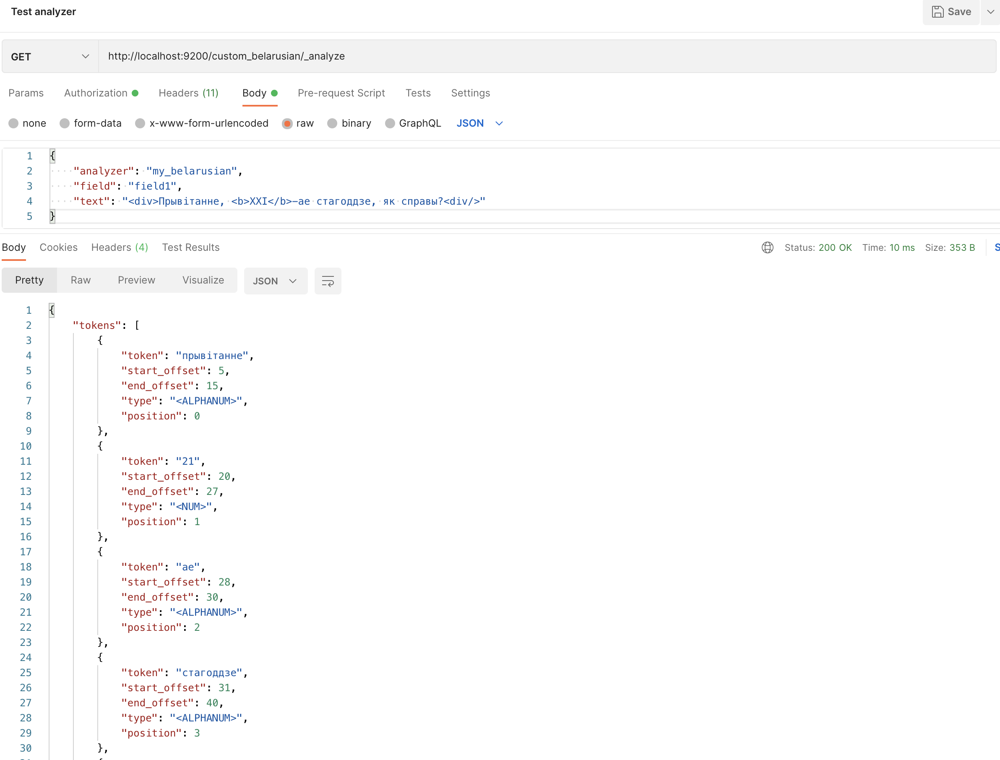

## Task 7.1

### Development

1. Use nix and enter the shell (`nix develop` if you have flake support, `nix-shell` otherwise), or make sure you have sbt on the PATH
2. Run sbt - after it loads, type `project t7_1` then type `run <cli params>`
3. Enjoy

### Results

1. Build the plugin distribution artefact `universal:packageZipTarball` (can be found under the `target/universal` folder)
2. Copy the archive to your Elasticsearch docker container `docker cp roman2arabic-1.0.zip elk:/roman2arabic-1.0.zip`
3. Install plugin
```bash
cd $ELASTIC_HOME
bin/elasticsearch-plugin install file:///roman2arabic-1.0.zip
```
You will see something like this:

4. Restart your instance of Elasticsearch
5. Create a new test index with the following setting for analysis (the full request body available under the request directory):
```json
{
    "settings": {
        "analysis": {
            "filter": {
                "belarusian_stop": {
                    "type": "stop",
                    "stopwords": "_belarusian_"
                },
                "belarusian_keywords": {
                    "type": "keyword_marker",
                    "keywords": [...]
                }
            },
            "analyzer": {
                "my_belarusian": {
                    "char_filter": [
                        "html_strip"
                    ],
                    "tokenizer": "standard",
                    "filter": [
                        "roman2arabic",
                        "belarusian_stop",
                        "asciifolding",
                        "belarusian_keywords",
                        "lowercase"
                    ]
                }
            }
        }
    },
    "mappings": {
        "properties": {
            "field1": {
                "type": "text",
                "analyzer": "my_belarusian"
            }
        }
    }
}
```
6. Test the created analyzer with this request body:
```json
{
    "analyzer": "my_belarusian",
    "field": "field1",
    "text": "<div>Прывiтанне, <b>XXI</b>-ае стагоддзе, як справы?<div/>"
}
```
The response:

