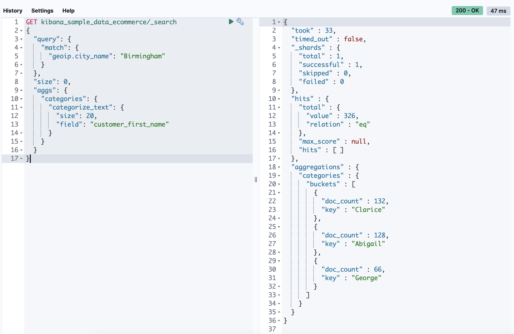
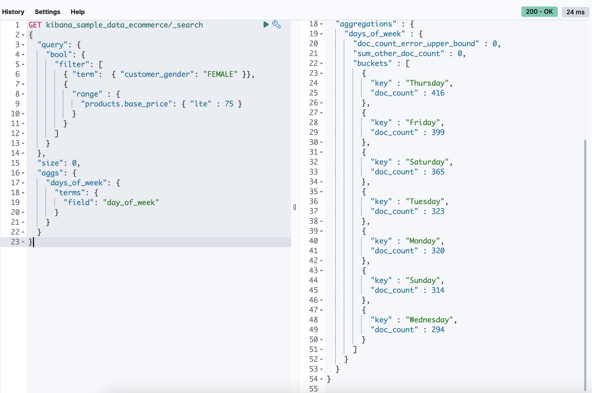
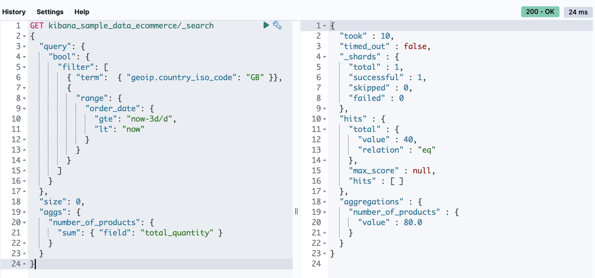
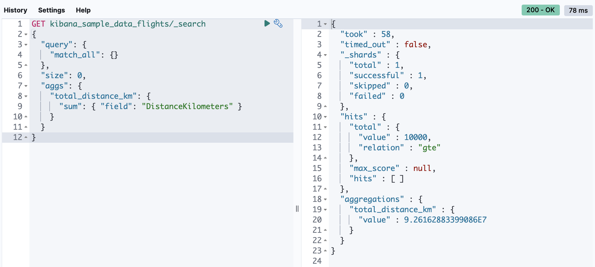
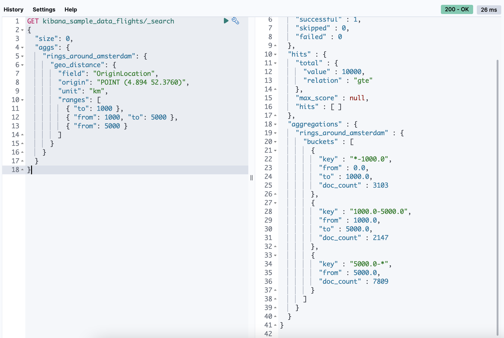
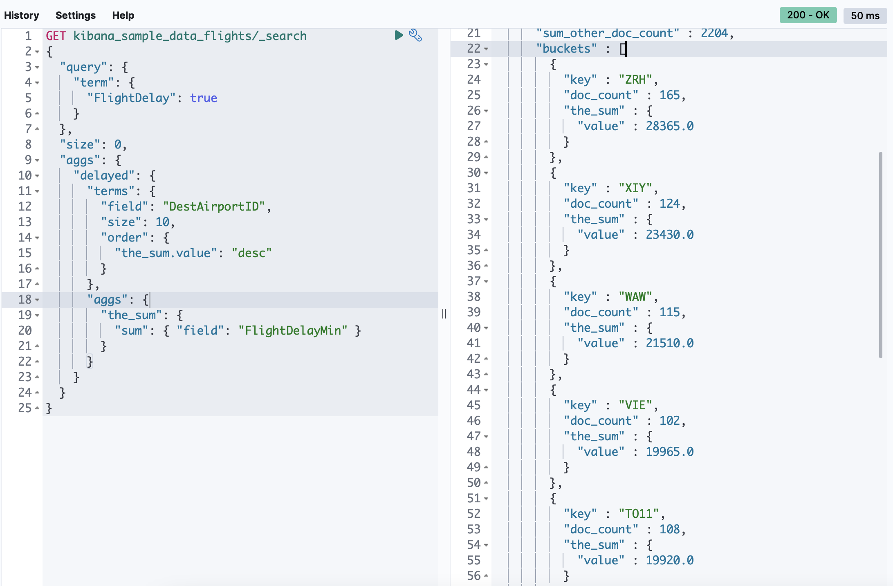
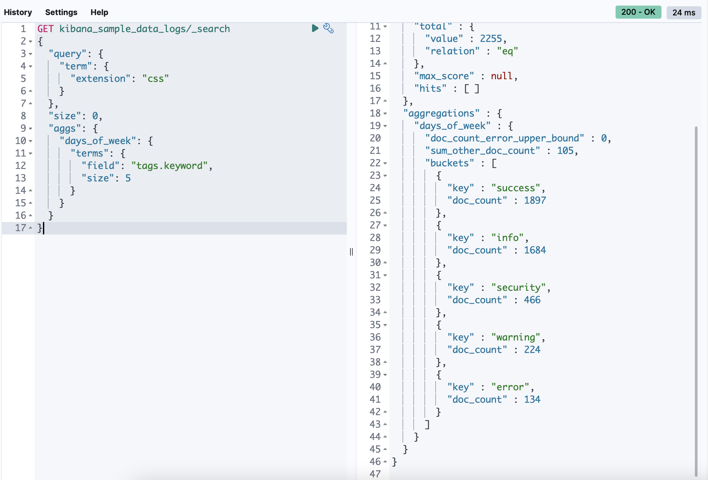
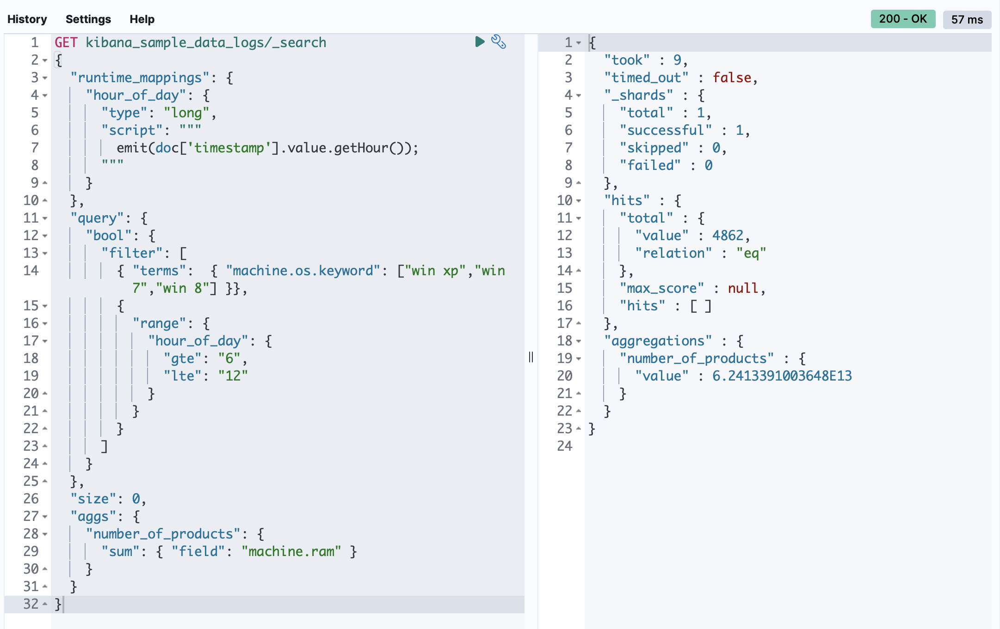
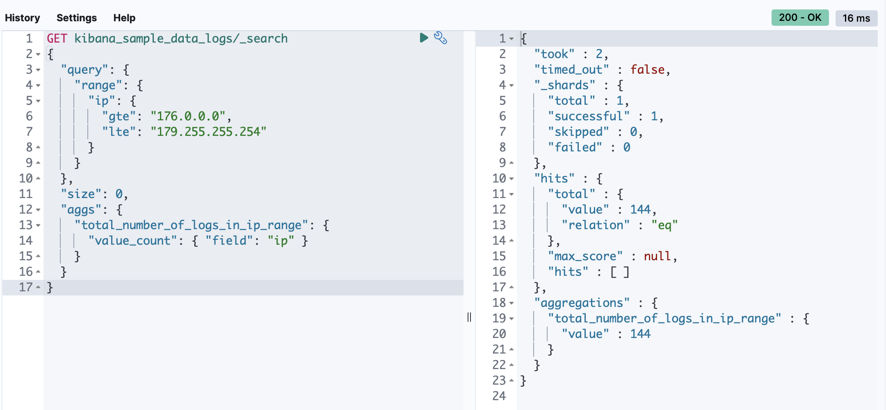

## Ecommerce data

### 1. Find top 20 most common first names of the customers from Birmingham
```shell
GET kibana_sample_data_ecommerce/_search
{
  "query": {
    "match": {
      "geoip.city_name": "Birmingham"
    }
  }, 
  "size": 0, 
  "aggs": {
    "categories": {
      "categorize_text": {
        "size": 20,
        "field": "customer_first_name"
      }
    }
  }
}
```


### 2. What is most active (most orders) for women buying products cheaper than 75$
```shell
GET kibana_sample_data_ecommerce/_search
{
  "query": {
    "bool": {
      "filter": [
        { "term":  { "customer_gender": "FEMALE" }},
        {
          "range" : {
            "products.base_price": { "lte" : 75 }
          }
        }
      ]
    }
  }, 
  "size": 0, 
  "aggs": {
    "days_of_week": {
      "terms": {
        "field": "day_of_week"
      }
    }
  }
}
```


### 3. How many products were bought in the last 3 days with customers from Great Britain
```shell
GET kibana_sample_data_ecommerce/_search
{
  "query": {
    "bool": {
      "filter": [
        { "term":  { "geoip.country_iso_code": "GB" }},
        {
          "range": {
            "order_date": {
              "gte": "now-3d/d",
              "lt": "now"
            }
          }
        }
      ]
    }
  }, 
  "size": 0, 
  "aggs": {
    "number_of_products": { 
      "sum": { "field": "total_quantity" } 
    }
  }
}
```



## Flights data

### 1. Total distance travelled by all flights
```shell
GET kibana_sample_data_flights/_search
{
  "query": {
    "match_all": {}
  }, 
  "size": 0, 
  "aggs": {
    "total_distance_km": { 
      "sum": { "field": "DistanceKilometers" } 
    }
  }
}
```


### 2. Geo distance aggregation from Amsterdam Airport (or any other if you don't have it) with several 1000km ranges
```shell
GET kibana_sample_data_flights/_search
{
  "size": 0, 
  "aggs": {
    "rings_around_amsterdam": {
      "geo_distance": {
        "field": "OriginLocation",
        "origin": "POINT (4.894 52.3760)",
        "unit": "km",
        "ranges": [
          { "to": 1000 },
          { "from": 1000, "to": 5000 },
          { "from": 5000 }
        ]
      }
    }
  }
}
```


### 3. Top-10 most delayed destination airports
```shell
GET kibana_sample_data_flights/_search
{
  "query": {
    "term": {
      "FlightDelay": true 
    }
  }, 
  "size": 0, 
  "aggs": {
    "delayed": {
      "terms": {
        "field": "DestAirportID",
        "size": 10,
        "order": {
          "the_sum.value": "desc"
        }
      },
      "aggs": {
        "the_sum": {
          "sum": { "field": "FlightDelayMin" }
        }
      }
    }
  }
}
```



## Logs data

### 1. Top 5 tags in logs which contains request to deliver css files
```shell
GET kibana_sample_data_logs/_search
{
  "query": {
    "term": {
      "extension": "css" 
    }
  },
  "size": 0, 
  "aggs": {
    "days_of_week": {
      "terms": {
        "field": "tags.keyword",
        "size": 5
      }
    }
  }
}
```


### 2. What is sum of all RAM for Windows machines that have requests from 6am to 12 pm
```shell
GET kibana_sample_data_logs/_search
{
  "runtime_mappings": {
    "hour_of_day": {
      "type": "long",
      "script": """
        emit(doc['timestamp'].value.getHour());
      """
    }
  }, 
  "query": {
    "bool": {
      "filter": [
        { "terms":  { "machine.os.keyword": ["win xp","win 7","win 8"] }},
        {
          "range": {
            "hour_of_day": {
              "gte": "6",
              "lte": "12"
            }
          }
        }
      ]
    }
  }, 
  "size": 0, 
  "aggs": {
    "number_of_products": { 
      "sum": { "field": "machine.ram" } 
    }
  }
}
```


### 3. Find total number of logs with IP in range from 176.0.0.0 to 179.255.255.254
```shell
GET kibana_sample_data_logs/_search
{
  "query": {
    "range": {
      "ip": {
        "gte": "176.0.0.0",
        "lte": "179.255.255.254"
      }
    }
  }, 
  "size": 0, 
  "aggs": {
    "total_number_of_logs_in_ip_range": { 
      "value_count": { "field": "ip" } 
    }
  }
}
```
